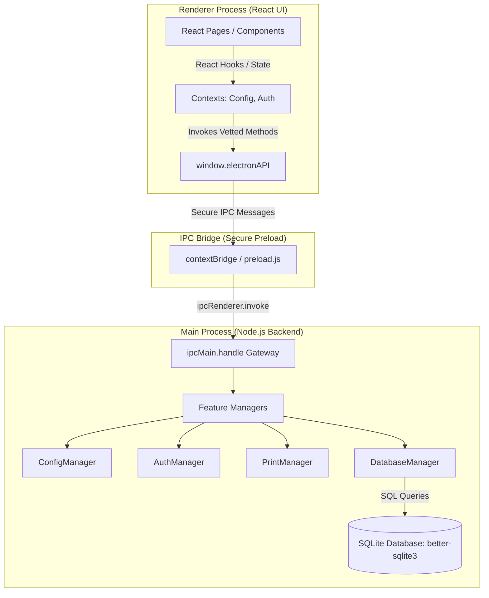

# **⚙️ ARCHITECTURE_MASTER.md: System Architecture & Engine Blueprint**

This document serves as the **Single Source of Truth** for the application's engine and wiring. All technical designs, state structures, and communication pathways must strictly align with the patterns defined here.

---

## **1. Architectural Overview & Process Separation**
The system is built on a highly secure, offline-first Electron + React wrapper. To ensure desktop-level security and high performance, the application enforces a strict physical separation between the backend (Main Process) and the frontend (Renderer Process).



---

## **2. Process Separation Responsibilities**

### **A. Main Process (The Backend Engine)**
* Runs in a full Node.js environment with native access to OS operations, filesystem (`fs`), and hardware APIs.
* **Responsibilities:**
  * Initializing the local SQLite database.
  * Reading, writing, validating, and monitoring the `config.json` file.
  * Executing native actions like SQL transactions, backup scheduling, and physical printer commands (ESC/POS and PDF).
  * Exposing secure IPC endpoints via `ipcMain.handle`. **Never** execute arbitrary code or SQL strings sent directly from the frontend.

### **B. Preload Script (The Secure Gatekeeper)**
* Runs in an isolated execution context with limited access to both Electron APIs and the DOM.
* **Responsibilities:**
  * Defines a tight, non-configurable `window.electronAPI` bridge using `contextBridge.exposeInMainWorld`.
  * **Strict Enforcement:** Absolutely do not expose `ipcRenderer` or native Node.js imports directly to the frontend.

### **C. Renderer Process (The Frontend UI)**
* Runs inside a secure sandboxed browser window with zero direct access to Node.js APIs or the local OS.
* **Responsibilities:**
  * Handling visual layout, animations (`Framer Motion`), styling (`Tailwind CSS`), and UI state.
  * Consuming system configuration via React Contexts (`ConfigContext`, `AuthContext`) and custom hooks (`useConfig`).
  * Requesting data or triggering operations *exclusively* by invoking the async methods exposed on `window.electronAPI`.

---

## **3. The Configuration Engine (`config.json`)**
The entire application behaves as a dynamic shell. The visual states and functional features adapt in real-time based on the following config schema:

```json
{
  "shop_info": {
    "name": "Billing Pro 2026",
    "type": "pharmacy",
    "tax_label": "GST/VAT",
    "logo_path": "assets/logo.png"
  },
  "theme": {
    "mode": "dark",
    "primary_color": "#2563eb"
  },
  "features": {
    "user_auth": true,
    "barcode_scanner": true,
    "expiry_tracking": true,
    "thermal_printing": true,
    "inventory_management": true,
    "credit_ledger": true
  },
  "custom_fields": [
    { "label": "Batch No", "key": "batch" },
    { "label": "Expiry Date", "key": "expiry" }
  ],
  "billing_settings": {
    "print_format": "A4",
    "round_off": true,
    "tax_breakdown": true
  }
}
```

### **Dynamic Behavioral Controls:**
1. **Theming:** The application reads `theme.primary_color` and `theme.mode` at boot and dynamically injects CSS root properties for real-time brand matching.
2. **Feature Flags:** Sidebar routes and visual tabs check `features.*`. Disabled features (e.g. `credit_ledger`) are completely unmounted from the DOM and routes.
3. **Custom Fields:** Dynamic fields (e.g., `batch`, `expiry`) dictate both database product records (stored as a JSON string under metadata) and the HTML form fields rendered in the Inventory management portal.

---

## **4. Core Backend Managers**

### **A. ConfigManager**
* Reads the localized user settings.
* Performs JSON schema validation on startup.
* Provides a write interface to safely persist user modifications.
* Exposes standard fallback templates (`default_config.json`) if file reads fail.

### **B. DatabaseManager**
* Connects to SQLite via `better-sqlite3`.
* Handles automated schema migrations during app initialization.
* Executes transactional operations.
* Manages automated daily file backups to a localized `backups/` directory.

### **C. PrintManager**
* Automatically branches behavior based on `billing_settings.print_format`:
  * **Thermal Format:** Connects to native system drivers and compiles raw ESC/POS sequences for optimized high-speed ticket printing.
  * **A4 Format:** Injects print stylesheet, compiles layout into a hidden render window, and invokes native OS window printing.

### **D. AuthManager**
* Compares incoming credentials against SQLite-hashed data.
* Restricts critical operations (e.g., product updates, database backups, configurations) using role validation.

---

## **5. Security Hardening & Isolation Checklist**
* [x] **`nodeIntegration` is disabled** in all BrowserWindow configurations.
* [x] **`contextIsolation` is enabled** globally.
* [x] **`sandbox` is active** in BrowserWindow webPreferences.
* [x] **No dynamic SQL assembly** on the frontend; all parameters are bound in compiled SQLite statements in the Main process.
* [x] **Zero external script sources** allowed in HTML policies.

---
*Document Status: ACTIVE | System Architecture Blueprint 2026-05-17*
