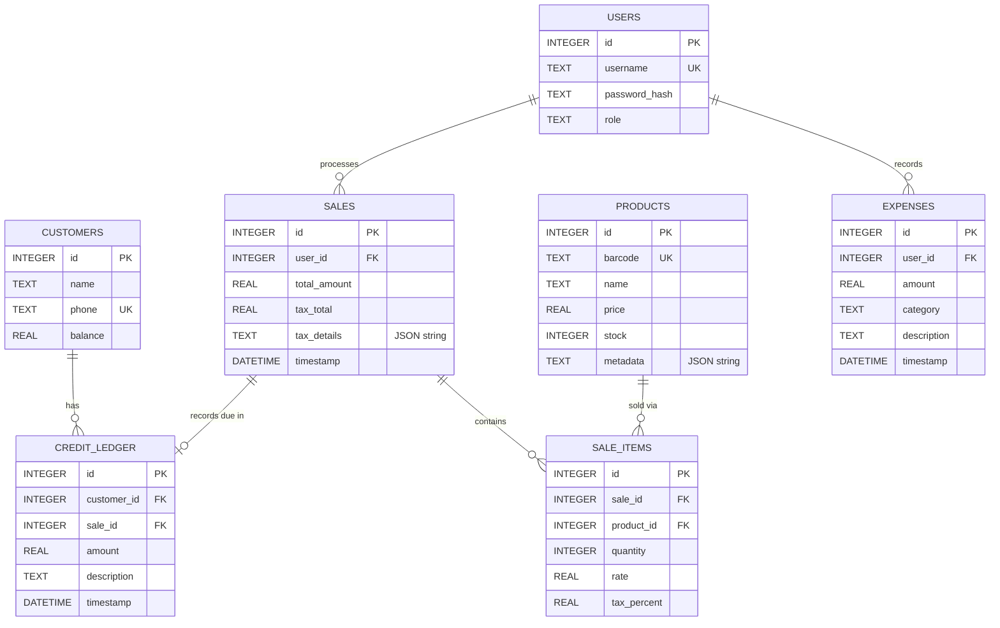

# **🗃️ SCHEMA.md: Local SQLite Database Blueprint**

This document serves as the **Database Architecture Specification** for the offline-first billing system. All migrations, database operations, and data models must adhere to the schemas and conventions defined below.

---

## **1. Database Engine & Connection Optimization**
* **Engine:** SQLite via the highly efficient `better-sqlite3` native Node.js wrapper.
* **Storage Location:** 
  * **Development:** Root level `db/billing_dev.db`
  * **Production:** Local User Data Directory (`app.getPath('userData')/db/billing.db`)
* **Optimization Directives:**
  To guarantee maximum reliability and write speeds during high-traffic checkout flows, the database must initialize with the following session parameters:
  ```sql
  PRAGMA foreign_keys = ON;         -- Enforce relational database integrity
  PRAGMA journal_mode = WAL;        -- Write-Ahead Logging for high-performance concurrent reads/writes
  PRAGMA synchronous = NORMAL;      -- Balances crash-safety with disk speed
  ```

---

## **2. Entity Relationship Diagram (ERD)**



---

## **3. Detailed Table Schemas (DDL)**

### **A. Users Table**
Stores cashier and administrator login credentials.
```sql
CREATE TABLE IF NOT EXISTS users (
    id INTEGER PRIMARY KEY AUTOINCREMENT,
    username TEXT UNIQUE NOT NULL,
    password_hash TEXT NOT NULL,
    role TEXT CHECK(role IN ('Admin', 'Cashier')) NOT NULL
);
```

### **B. Products Table**
Holds core inventory records. Dynamic attributes (e.g., Expiry Date, Batch No) are serialized in the `metadata` JSON field.
```sql
CREATE TABLE IF NOT EXISTS products (
    id INTEGER PRIMARY KEY AUTOINCREMENT,
    barcode TEXT UNIQUE, -- Can be null, but must be unique if present
    name TEXT NOT NULL,
    price REAL NOT NULL CHECK(price >= 0.0),
    stock INTEGER NOT NULL DEFAULT 0,
    metadata TEXT DEFAULT '{}' -- Stores JSON payload for custom config fields
);
```

### **C. Sales Table**
Registers overall transactional summaries.
```sql
CREATE TABLE IF NOT EXISTS sales (
    id INTEGER PRIMARY KEY AUTOINCREMENT,
    user_id INTEGER NOT NULL REFERENCES users(id),
    total_amount REAL NOT NULL CHECK(total_amount >= 0.0),
    tax_total REAL NOT NULL DEFAULT 0.0 CHECK(tax_total >= 0.0),
    tax_details TEXT DEFAULT '{}', -- Stores JSON breakdown (e.g., {"CGST_9": 4.5, "SGST_9": 4.5})
    timestamp DATETIME DEFAULT CURRENT_TIMESTAMP
);
```

### **D. Sale Items Table**
Maps individual line items to sales. Maintains transactional rates even if the global product price changes.
```sql
CREATE TABLE IF NOT EXISTS sale_items (
    id INTEGER PRIMARY KEY AUTOINCREMENT,
    sale_id INTEGER NOT NULL REFERENCES sales(id) ON DELETE CASCADE,
    product_id INTEGER NOT NULL REFERENCES products(id),
    quantity INTEGER NOT NULL CHECK(quantity > 0),
    rate REAL NOT NULL CHECK(rate >= 0.0),
    tax_percent REAL NOT NULL DEFAULT 0.0 CHECK(tax_percent >= 0.0)
);
```

### **E. Customers Table**
Tracks account details for business-to-business (B2B) clients or consumers with open credit logs.
```sql
CREATE TABLE IF NOT EXISTS customers (
    id INTEGER PRIMARY KEY AUTOINCREMENT,
    name TEXT NOT NULL,
    phone TEXT UNIQUE NOT NULL,
    balance REAL DEFAULT 0.0 -- Outstanding credit ledger balance
);
```

### **F. Credit Ledger Table**
Logs dynamic ledger transactions ("Udhaar Book"). Negative amounts represent payments received; positive amounts represent credit extended.
```sql
CREATE TABLE IF NOT EXISTS credit_ledger (
    id INTEGER PRIMARY KEY AUTOINCREMENT,
    customer_id INTEGER NOT NULL REFERENCES customers(id) ON DELETE CASCADE,
    sale_id INTEGER REFERENCES sales(id) ON DELETE SET NULL, -- Maps to a transaction if applicable
    amount REAL NOT NULL, -- Positive = Credit issued, Negative = Cash payment made
    description TEXT,
    timestamp DATETIME DEFAULT CURRENT_TIMESTAMP
);
```

### **G. Expenses Table**
Tracks daily shop expenses (Kharcha) for accurate Day Book calculations.
```sql
CREATE TABLE IF NOT EXISTS expenses (
    id INTEGER PRIMARY KEY AUTOINCREMENT,
    user_id INTEGER NOT NULL REFERENCES users(id),
    amount REAL NOT NULL CHECK(amount > 0),
    category TEXT DEFAULT 'General',
    description TEXT,
    timestamp DATETIME DEFAULT CURRENT_TIMESTAMP
);
```

---

## **4. Custom JSON Columns Schema Specification**

### **A. `products.metadata` Schema**
Adapts dynamic custom fields from `config.json` rules:
```json
{
  "batch": "B-X892-2026",
  "expiry": "2028-11-30",
  "dosage": "500mg"
}
```

### **B. `sales.tax_details` Schema**
Adapts dynamic tax breakdowns:
```json
{
  "tax_label": "GST",
  "breakdown": {
    "CGST_9": 18.23,
    "SGST_9": 18.23
  }
}
```

---

## **5. Database Optimization & Indexing Strategy**
To maintain responsive search benchmarks (<50ms query speeds) under catalog counts of up to 100,000 products:
```sql
CREATE INDEX IF NOT EXISTS idx_products_barcode ON products(barcode) WHERE barcode IS NOT NULL;
CREATE INDEX IF NOT EXISTS idx_products_name ON products(name);
CREATE INDEX IF NOT EXISTS idx_sale_items_sale_id ON sale_items(sale_id);
CREATE INDEX IF NOT EXISTS idx_sales_timestamp ON sales(timestamp);
CREATE INDEX IF NOT EXISTS idx_credit_ledger_customer ON credit_ledger(customer_id);
```

---

## **6. Initial Seed Records**
On database initialization, if the `users` table is detected empty, the system must trigger this seed transaction:
```sql
-- Seed default super-administrator user: admin / admin123
-- (Secure hash of 'admin123' must be generated by AuthManager, below is a conceptual hash)
INSERT INTO users (username, password_hash, role) 
VALUES ('admin', '$2b$10$wE99CgW8p0h/2Gq7C56SaeQeWz8m6Vj7L2r4zG.cM9gJk88b/v/sO', 'Admin');
```

---
*Document Status: ACTIVE | Database Blueprint 2026-05-17*
