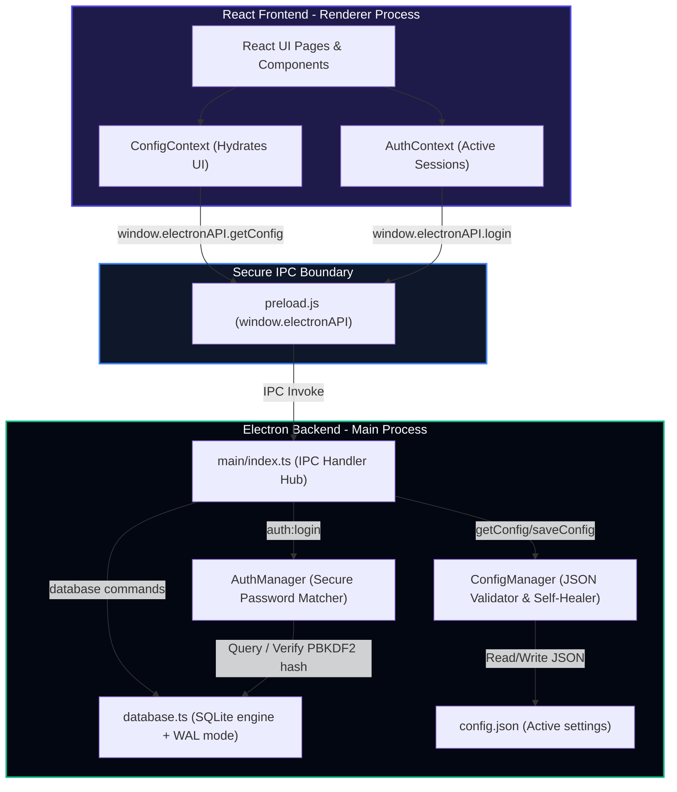

# **📊 Billing Pro 2026: Project Progress Status Report**

Welcome to the comprehensive status report for the **Billing Pro 2026: Offline-First, Config-Driven Billing System**. 

---

## **🇮🇳 संक्षिप्त सारांश (Executive Summary - Hindi)**

अब तक का काम **बहुत ही व्यवस्थित (structured) और मजबूत** तरीके से आगे बढ़ा है। हमने प्रोजेक्ट की ठोस नींव (foundation) तैयार कर ली है।
* **Phase 1 (Setup)** और **Phase 2 (Core Platform)** पूरी तरह से **100% Complete** हो चुके हैं।
* **Phase 3 (Dynamic UI Shell)** पर अभी काम चालू है (**In Progress**)।
* हमारी मुख्य उपलब्धियों में **सुरक्षित SQLite (better-sqlite3) WAL मोड डेटाबेस**, **PBKDF2 पासवर्ड हैशिंग**, **डिफ़ॉल्ट एडमिन सीडिंग (admin / admin123)**, **Dynamic ConfigManager (Self-healing & Failsafe)** और **React Auth & Config Contexts** शामिल हैं। 
* हमारा React Frontend पूरी तरह से Electron Main Process से सुरक्षित IPC Channels (Preload sandboxing) के ज़रिए बातचीत करता है।

---

## **🇬🇧 Executive Summary (English)**

The progress on **Billing Pro 2026** has been highly structured and engineered with extreme rigor.
* **Phase 1 (Setup)** and **Phase 2 (Core Platform Foundation)** are **100% completed**.
* **Phase 3 (Dynamic UI Shell & Custom Field Engine)** is currently **In Progress (🚧)**.
* **Key Achievements:** We have built a high-performance SQLite database engine using `better-sqlite3` configured in high-speed WAL mode, dynamic self-healing Configuration management with automated failsafe rollbacks, robust PBKDF2 offline authentication, and initialized clean React state managers (`ConfigContext` and `AuthContext`).
* **Security & Sandboxing:** The renderer process is 100% isolated, interacting with Node/SQLite exclusively over secure IPC channels exposed via `preload.js`.

---

## **📸 Live Testing Visual Carousel (Verified UI States)**

````carousel

<!-- slide -->

<!-- slide -->

<!-- slide -->

````

---

## **📐 System Architecture & Data Flow**

The following Mermaid diagram outlines the clean separation of concerns and sandbox boundary successfully established in **Phase 2**:



---

## **📋 Detailed Phase-by-Phase Roadmap Status**

### **Phase 1: Project Setup & AI Engine Integration (100% ✅)**
* **[x] Workspace Directories:** Structured workspace containing `main/` (backend logic), `src/` (React frontend), `assets/`, `config/`, and `.ai/` (Single Source of Truth).
* **[x] TypeScript Presets:** Configured and validated standard presets (`tsconfig.json`, `tsconfig.node.json`).
* **[x] Rules of Engagement:** Defined and loaded custom environment rules inside `.antigravityrules`, `GEMINI.md`, and `AGENTS.md`.
* **[x] Configurations:** Created active dynamic profiles: `config.json` and `default_config.json`.

---

### **Phase 2: Core Platform Foundation (100% ✅)**
* **[x] SQLite Relational Persistence:**
  * Configured `main/db/database.ts` using `better-sqlite3`.
  * Optimized DB engine using `foreign_keys = ON`, `journal_mode = WAL` (Write-Ahead Logging) and `synchronous = NORMAL` (ensures power-interruption safety).
  * Implemented structured DDL schema migrations: `users`, `products`, `sales`, `sale_items`, `customers`, and `credit_ledger` tables along with performance-boosting database indexes.
* **[x] Cryptographic Security:**
  * Programmed a secure PBKDF2 (SHA-512) password hashing engine locally.
  * Seeded a default Super-Administrator record (`admin` / `admin123`) securely hashed during startup.
* **[x] Self-Healing ConfigManager:**
  * Created `main/managers/ConfigManager.ts` to coordinate reading and writing dynamic features.
  * Integrated a rigorous JSON Schema Validator to prevent corrupted saves.
  * Added self-healing recovery triggers: if `config.json` is corrupted, it moves the bad config to `config_corrupt.json`, attempts to restore from `default_config.json`, and falls back to a hardcoded failsafe template to avoid application crashes.
* **[x] Offline Authentication Manager:**
  * Coded `main/managers/AuthManager.ts` to securely authenticate cashier/admin credentials.
  * Wired the secure IPC handlers under `auth:login` inside `preload.js`.
* **[x] React State Hydration Contexts:**
  * Built `ConfigContext.tsx` to automatically fetch and supply active settings parameters.
  * Developed `AuthContext.tsx` to support local user session management, using browser-sandbox persistent fallback controls (`localStorage`) for quick web-only testing.

---

### **Phase 3: Dynamic UI Shell & Custom Field Engine (In Progress 🚧)**
* **[x] Dynamic Navigation Sidebar:** Created an elegant dark sidebar in `src/pages/Dashboard.tsx` that changes layout buttons based on feature toggles like `config.features.barcode_scanner`, `inventory_management`, etc.
* **[x] Admin vs. Cashier Roles:** Toggle administrative UI elements dynamically based on user session role (Admin vs Cashier).
* **[x] Dynamic Form Renderer (`DynamicForm.tsx`):** Built a highly flexible, type-safe React component that intelligently parses the `config.custom_fields` array and dynamically renders beautiful UI inputs (e.g., auto-detecting `Expiry Date` to output calendar date pickers).
* **[ ] Global Dynamic Branding (Pending):** Hook HSL/Tailwind values to apply configuration-defined brand colors like `config.theme.primary_color`.

---

### **Phase 4 & 5: Core Operations & Packaging (Upcoming ⏳)**
* **[ ] Product Catalog CRUD System:** Forms to insert/update items, serializing dynamic custom fields into database `metadata` JSON column.
* **[ ] Checkout Terminal:** Real-time billing calculations, barcodes scanner integration with auto-focus focus traps, and tax breakdowns.
* **[ ] ESC/POS Thermal Printing:** Physical thermal print layouts.
* **[ ] Daily DB Backups & Reset Utility:** Automated backup triggers to a local `backups/` directory.
* **[ ] Product Compilation:** Executable compilation via `electron-builder` to generate a single self-contained Windows executable (`.exe`).

---

## **💡 Immediate Next Steps & Recommendations**

To keep moving productively, we should target the rest of **Phase 3**:
1. **Dynamic Brand Color Transitions:** Enhance theme loading transitions in React to dynamically map and smooth-out UI changes based on `config.theme.mode`.
2. **Global Dynamic Branding Completion:** Finalize hooking HSL/Tailwind values to securely apply configuration-defined brand colors like `config.theme.primary_color` seamlessly across all components.

> [!NOTE]
> All systems are extremely healthy. No active errors are listed in the diagnostic memory logs (`.ai/ERROR_LOGS.md`).
